# HVCS — Technical Design Document

## 1. System Overview

HVCS (Home Visit Care System) is a full-stack web application for managing home care visits, caregivers, and clients. It was built to address real operational needs in a home care organisation: scheduling visits, tracking caregiver check-in/out with GPS, monitoring compliance, and protecting personal data in line with GDPR (General Data Protection Regulation) as enforced in Ireland.

The system has two frontend surfaces backed by a single Django server:

- **Frontend A** — Django template-rendered HTML pages (the primary UI)
- **Frontend B** — A React 18 single-page application consuming a REST API

---

## 2. Technology Stack

| Layer | Technology | Reason |
|---|---|---|
| Backend framework | Django 6.0.6 | Rapid development, built-in ORM, admin, auth |
| REST API | Django REST Framework + SimpleJWT | Standard JWT-authenticated API for React SPA |
| Database | SQLite (development) / PostgreSQL (production via Render) | SQLite for zero-config local dev; Postgres for production reliability |
| Frontend A | Django Templates + custom CSS | Server-side rendering; no JavaScript dependency |
| Frontend B | React 18 + Vite | Modern SPA with role-aware routing |
| Deployment | Render | Cloud PaaS with managed Postgres and HTTPS |
| Static files | WhiteNoise | Serve static files directly from Django without a CDN |

---

## 3. Architecture

```
Browser
  │
  ├── /accounts/...      Django Template Views (Frontend A)
  │       │
  │       └── Django ORM → SQLite / Postgres
  │
  └── /react/...         React SPA (Frontend B)
          │
          └── /api/v1/   Django REST Framework Views
                  │
                  └── Django ORM → SQLite / Postgres
```

Both surfaces share the same database, models, and business logic. The only difference is the rendering layer: one returns HTML, the other returns JSON.

---

## 4. Data Model

### 4.1 Entity Relationship

```
User (AbstractUser + Role)
 ├── Caregiver  (OneToOne → User)
 └── [Manager and Admin users have no separate profile table]

Caregiver ──FK──► Visit ◄──FK── Client
```

### 4.2 Models

#### User
Extends Django's built-in `AbstractUser`. A custom `role` field (TextChoices: `ADMIN`, `MANAGER`, `CAREGIVER`) gates access to every view and API endpoint. A `created_by` FK records which admin created each account.

#### Caregiver
A profile linked 1-to-1 to a `User` record. Stores care-specific fields: `first_name`, `last_name`, `phone`, `qualifications`, `profile_image`, `employment_status`, `date_left`, and `is_active`.

Caregivers are **never hard-deleted**. Deleting a caregiver would orphan all their visit history and destroy the compliance audit trail. Instead, the system soft-deletes:
- `is_active = False` — removes them from active lists and the visit scheduling dropdown
- `employment_status` set to `RESIGNED` or `TERMINATED`
- `date_left` records when they left
- `user.is_active = False` — disables their login

The `anonymize()` method satisfies the GDPR right-to-erasure (Article 17) by overwriting all personal identifiers (name, phone, email, photo) while leaving the caregiver's `id` and visit records intact.

#### Client
Stores client details: `first_name`, `last_name`, `address`, `contact_phone`, `care_needs`. Also soft-deleted via `is_active`. An `assigned_caregiver` FK optionally links a client to their primary caregiver.

Clients are not users — they do not log in.

#### Visit
The central operational record. Links a `Caregiver` to a `Client` for a specific date and time. Tracks the full lifecycle:

| Status | Meaning |
|---|---|
| `SCHEDULED` | Visit is booked but not yet started |
| `IN_PROGRESS` | Caregiver has checked in |
| `COMPLETED` | Caregiver has checked out |
| `CANCELLED` | Admin cancelled the visit |

GPS check-in data (`check_in_lat`, `check_in_lng`, `check_in_address`) is stored when the caregiver checks in via the browser's Geolocation API. `check_in_time` and `check_out_time` record the exact timestamps.

### 4.3 Primary Keys and Foreign Keys

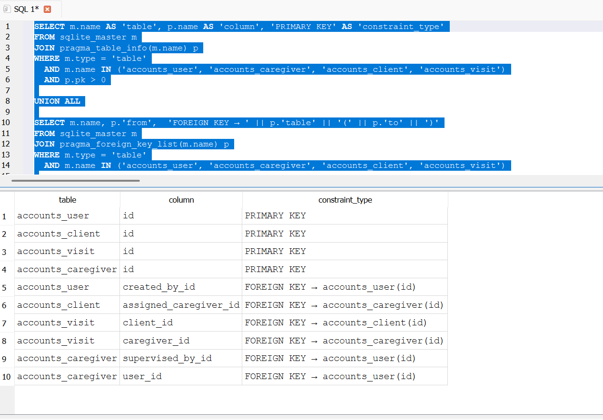

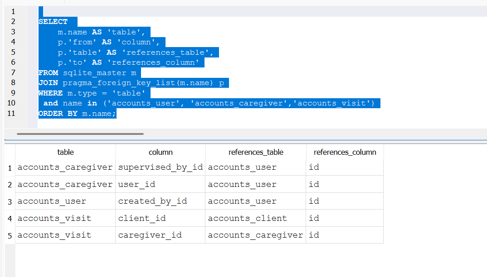

---

## 5. User Roles and Access Control

Three roles are enforced at every view and API endpoint:

| Role | Access |
|---|---|
| **ADMIN** | Full CRUD on caregivers, clients, visits, managers; compliance dashboard; CSV audit export |
| **MANAGER** | Read-only access to visits and compliance; can email caregiver schedules |
| **CAREGIVER** | Own dashboard and visits only; check-in/out |

**Django Template Views** enforce roles with two stacked decorators:

```python
@login_required
@role_required(User.Role.ADMIN)
def caregiver_list(request):
    ...
```

`@role_required` returns HTTP 403 if the user's role is not in the allowed set.

**REST API** enforces roles with custom DRF permission classes (`AdminOnly`, `AdminOrManager`, `CaregiverOnly`) derived from `IsAuthenticated`.

Account creation is intentionally restricted:
- **Admin** accounts can only be created at the command line (`createsuperuser` or `ensure_superuser` management command). This prevents web-based self-registration as admin.
- **Manager** accounts are created by an Admin through the web UI.
- **Caregiver** accounts are created by an Admin through the web UI or via the REST API self-registration endpoint.

---

## 6. Feature Breakdown

### 6.1 Caregiver Management (Admin)
- Create: Admin fills a form that creates both a `User` (with `role=CAREGIVER`) and a linked `Caregiver` profile in one transaction.
- Edit: `CaregiverUpdateForm` surfaces user fields (`username`, `email`) and profile fields (`phone`, `qualifications`, `is_active`) in a single form. The `save()` method writes to both the `User` and `Caregiver` tables.
- Soft-delete: Sets `is_active=False` on both the `Caregiver` and `User`. Optionally anonymises personal data (GDPR).
- Profile images: Uploaded to `caregiver_photos/` via Django's `ImageField`.

**Caregiver list (UI):**

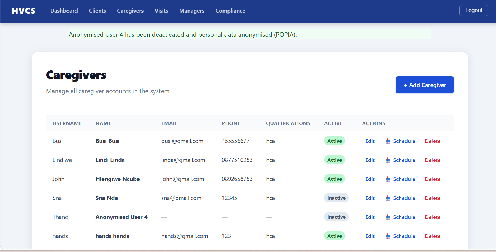

**Caregiver table in the database:**

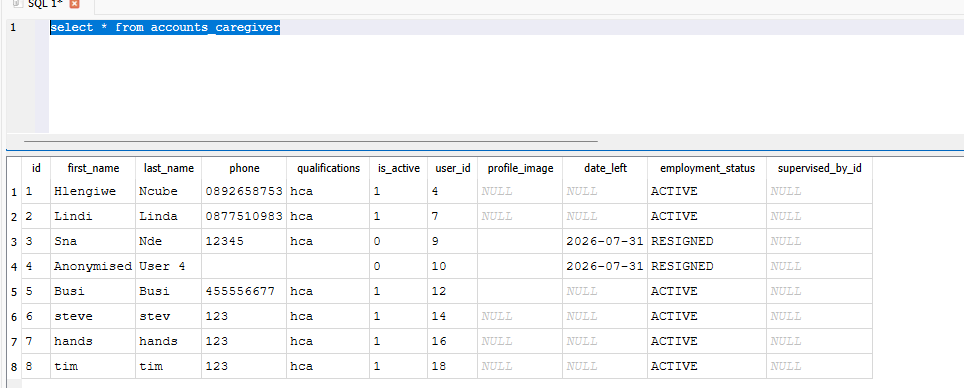

**Deactivate / anonymise confirmation page:**

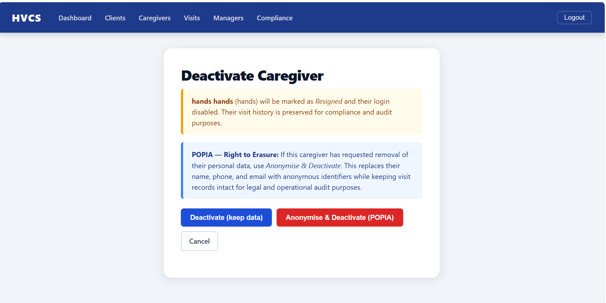

**Database state after deactivation:**

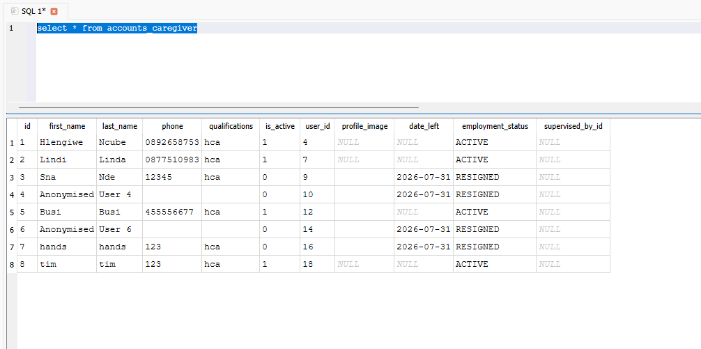

**Caregiver list after deactivation (inactive rows still visible):**

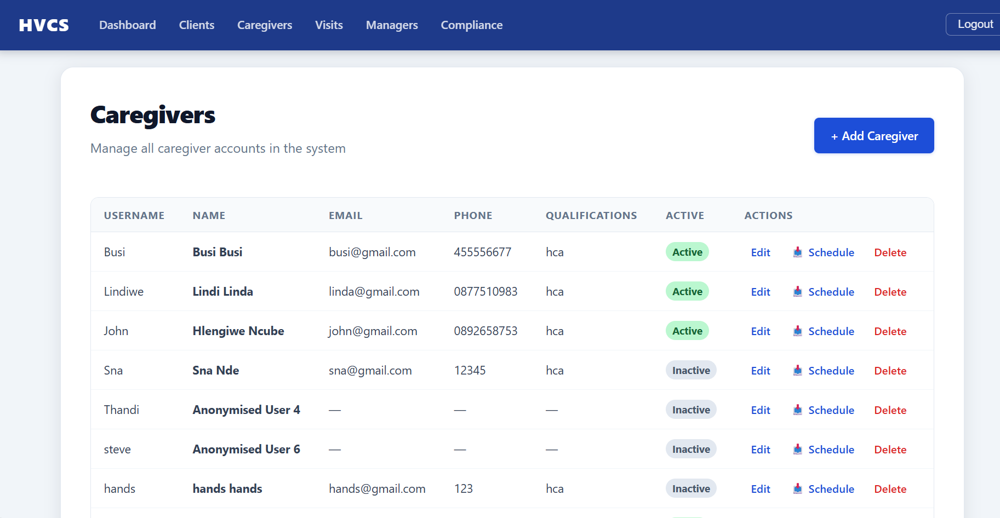

**Caregiver's assigned clients and visits (UI):**

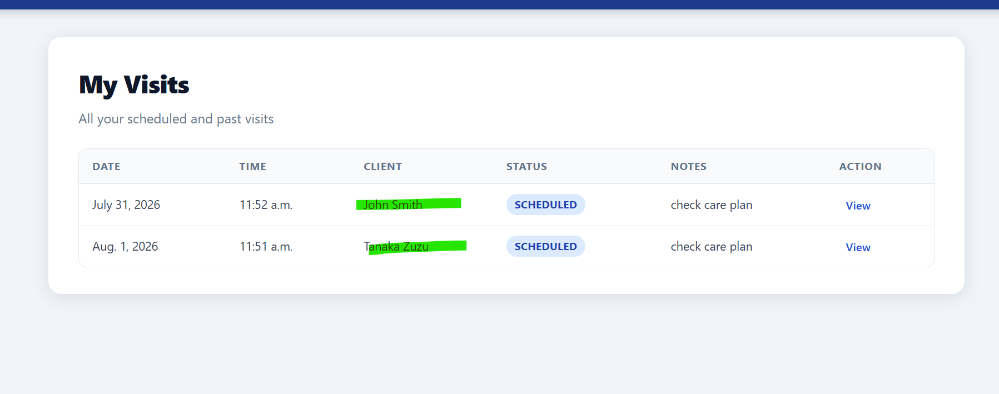

**Corresponding database state:**

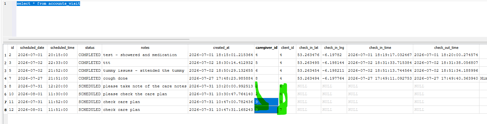

### 6.2 Client Management (Admin)
- Full CRUD via standard Django forms.
- Soft-deleted via `is_active` flag; inactive clients are excluded from active lists.

**Client list before adding new clients:**

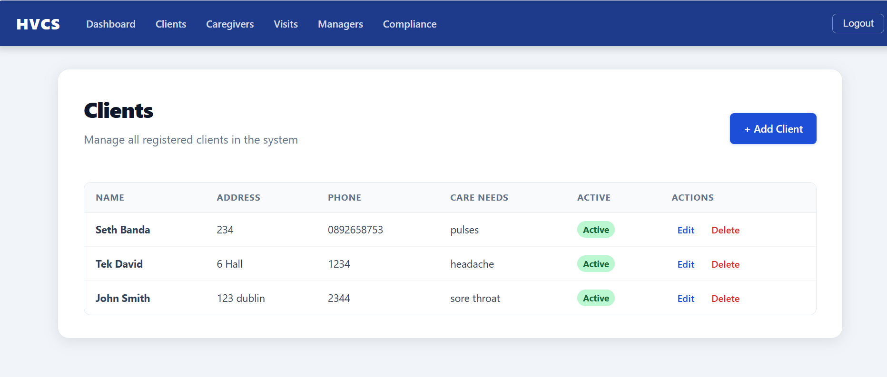

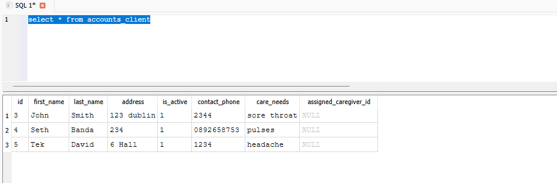

**After adding more clients:**

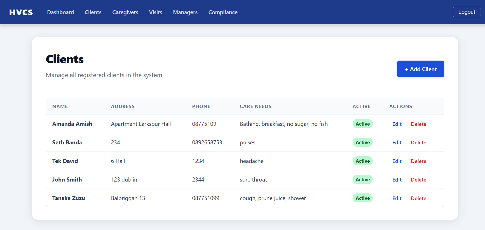

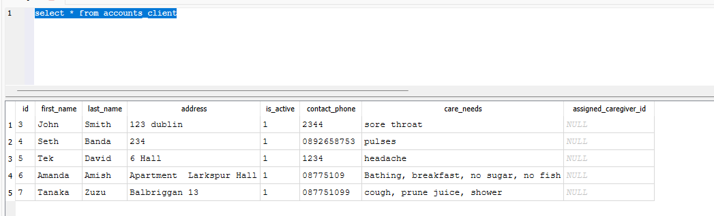

**After editing a client's care needs:**

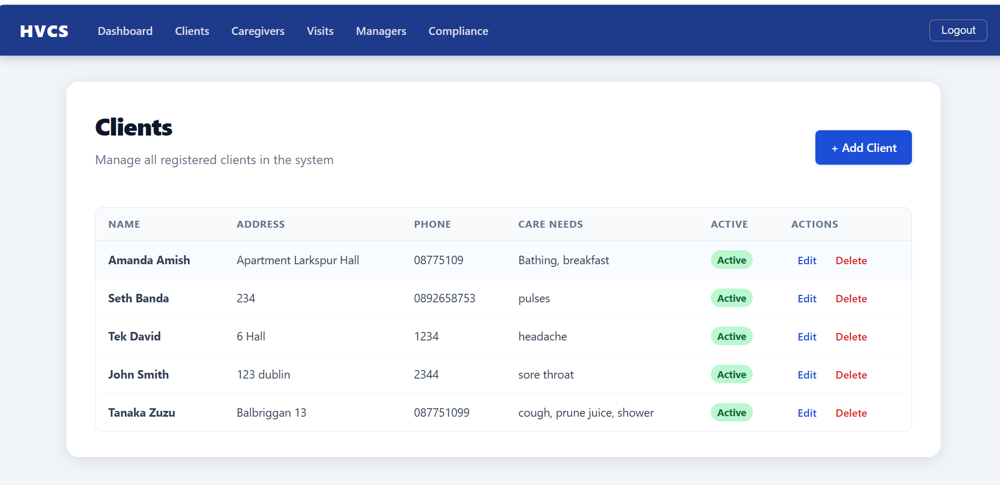

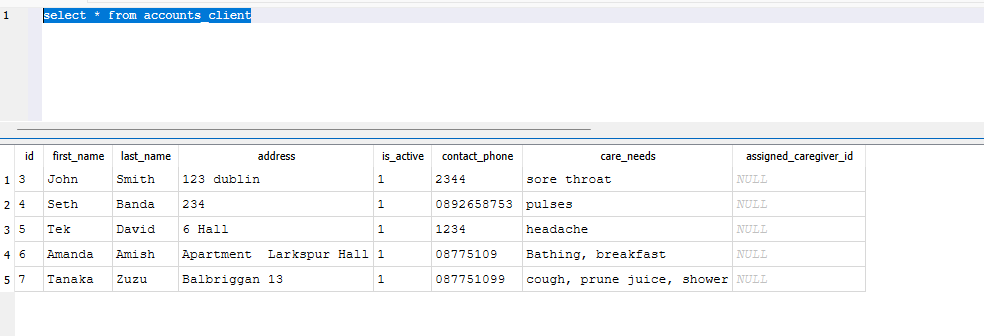

**After soft-deleting a client:**

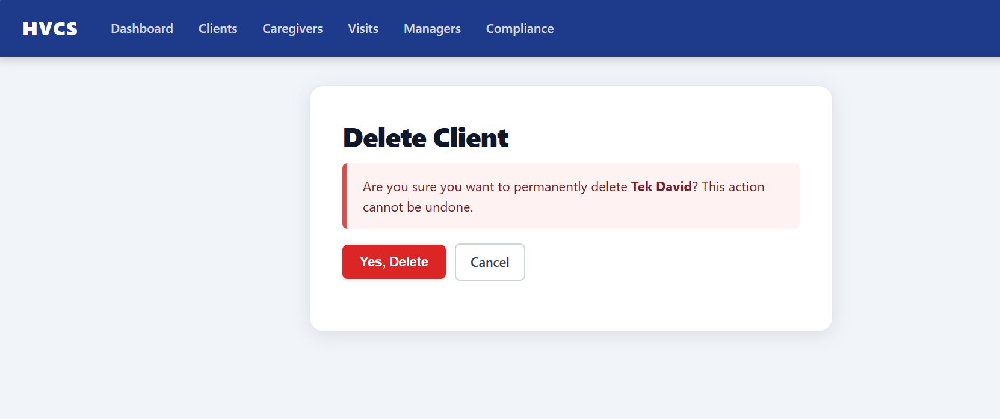

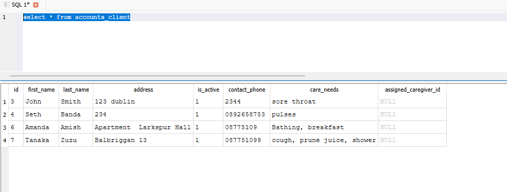

### 6.3 Visit Scheduling (Admin)
- `VisitForm` restricts the caregiver dropdown to `Caregiver.objects.filter(is_active=True)` — deactivated caregivers cannot be assigned new visits.
- Date and time inputs use HTML5 `type="date"` and `type="time"` widgets.
- The visit list page provides date-range and status filters via GET parameters (`date_from`, `date_to`, `status`).

**Visit list (UI) with filter bar and status badges:**

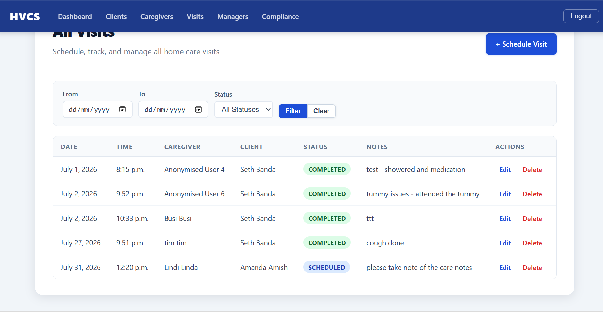

**Visit table in the database:**

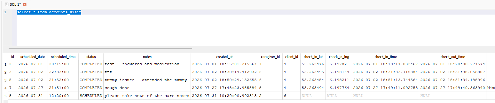

**After scheduling a new visit (UI):**

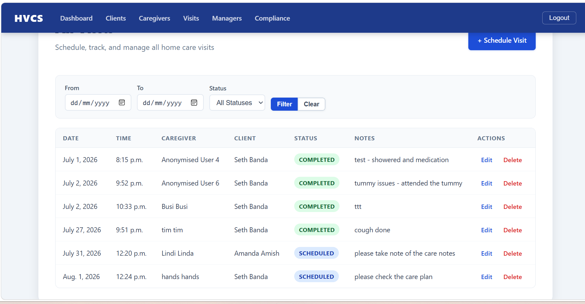

**After scheduling a new visit (DB):**

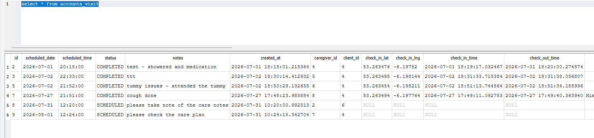

### 6.4 GPS Check-In / Check-Out (Caregiver)
When a caregiver checks in:
1. The browser's `navigator.geolocation.getCurrentPosition()` requests GPS coordinates.
2. Coordinates are posted to the Django view.
3. A server-side reverse-geocoding call to the OpenStreetMap Nominatim API converts the coordinates to a human-readable address, which is stored in `visit.check_in_address`.
4. `visit.status` transitions from `SCHEDULED` to `IN_PROGRESS`.

Check-out sets `check_out_time` and transitions status to `COMPLETED`.

GPS is optional — caregivers can check in without location permission and the visit will still be recorded.

**Admin dashboard:**

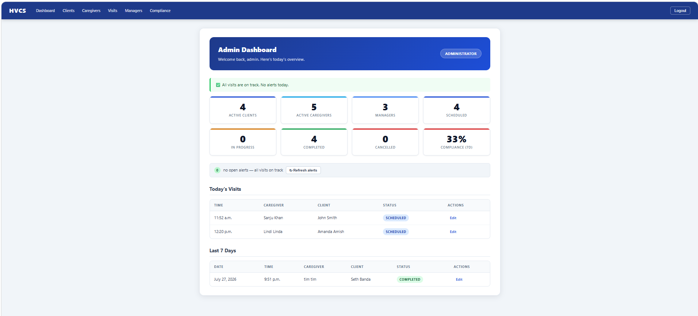

### 6.5 Compliance Dashboard (Admin and Manager)
The compliance dashboard surfaces:
- **Missed check-ins**: visits scheduled for today where the scheduled time passed 15+ minutes ago and the caregiver has not checked in.
- **Never-started**: visits from the past 7 days still in `SCHEDULED` status.
- **7-day completion rate**: `completed / (all non-cancelled)` × 100, shown as a percentage.
- **Visit status counts**: scheduled, in-progress, completed, cancelled.

### 6.6 CSV Audit Export (Admin)
Admin can download a CSV of all visits in a selected date range from the compliance dashboard. The export includes date, time, caregiver, client, status, check-in/out times, GPS address, and notes. Built using Python's `csv` module streamed directly into an `HttpResponse`.

### 6.7 Schedule Email (Manager)
Manager can email a caregiver their upcoming schedule. The view fetches all future `SCHEDULED` visits for the caregiver and sends a plain-text email via Django's `send_mail`.

### 6.8 REST API (Frontend B — React SPA)
All API endpoints live under `/api/v1/` and require a JWT Bearer token in the `Authorization` header.

| Endpoint | Method | Role | Description |
|---|---|---|---|
| `/auth/login/` | POST | Any | Obtain access + refresh JWT tokens |
| `/auth/me/` | GET | Authenticated | Current user profile and role |
| `/auth/register/` | POST | Any | Caregiver self-registration |
| `/clients/` | GET, POST | Admin | List / create clients |
| `/clients/<pk>/` | GET, PUT, PATCH, DELETE | Admin | Retrieve / update / delete client |
| `/caregivers/` | GET, POST | Admin | List / create caregivers |
| `/caregivers/<pk>/` | GET, PUT, PATCH, DELETE | Admin | Retrieve / update / delete caregiver |
| `/visits/` | GET | Authenticated | List visits (caregivers see own only) |
| `/visits/` | POST | Admin | Create visit |
| `/visits/<pk>/checkin/` | POST | Caregiver | Check in (optionally with GPS) |
| `/visits/<pk>/checkout/` | POST | Caregiver | Check out |
| `/managers/` | GET, POST | Admin | List / create managers |
| `/dashboard/admin/` | GET | Admin | Aggregated stats + alerts |
| `/dashboard/manager/` | GET | Admin, Manager | Today's visits + alerts |
| `/dashboard/caregiver/` | GET | Caregiver | Own visits |

### 6.9 React SPA (Frontend B)
The React app (Vite, React 18, React Router) runs on a separate Vite dev server (`localhost:5173`) in development and is served as a static build in production. After login it calls `/api/v1/auth/me/` to determine the user's role and renders the appropriate dashboard:

- **Admin**: stats cards, compliance alerts, today's visit table, navigation to clients/caregivers/visits/compliance pages.
- **Manager**: today's visits and compliance alerts.
- **Caregiver**: own upcoming visits with check-in/out buttons.

---

## 7. Database Migrations

Django migrations track every schema change as a versioned file:

| Migration | Change |
|---|---|
| `0001_initial` | `User` model with `role` field |
| `0002_client` | `Client` model |
| `0003_caregiver` | `Caregiver` model |
| `0004_align_client_to_erd` | Added `assigned_caregiver` FK and `care_needs` |
| `0005_visit` | `Visit` model with status choices |
| `0006_visit_gps_checkin` | GPS lat/lng fields on `Visit` |
| `0007_visit_check_in_address` | Reverse-geocoded address field |
| `0008_profile_image` | `profile_image` on `Caregiver` |
| `0009_caregiver_soft_delete` | `employment_status` and `date_left` fields |
| `0010_add_relationship_fks` | `supervised_by` and `created_by` FKs |

---

## 8. Security

### Authentication
- Django session authentication for the template frontend (HttpOnly cookies).
- JWT access + refresh tokens (SimpleJWT) for the REST API. Access tokens are short-lived.
- Passwords hashed with PBKDF2-SHA256 and a random salt (Django default).

### Authorisation
- Every protected view has `@login_required` + `@role_required(...)`.
- Every API endpoint has an explicit `permission_classes` that checks both authentication and role.
- Caregivers can only read their own visits — queries are filtered by `request.user`.

### Injection Prevention
- Django ORM is used throughout — no raw SQL. All queries are parameterised.
- Django templates auto-escape all user-supplied values, preventing XSS.
- No shell commands or subprocess calls.

### CSRF
All HTML forms include ``. Django's `CsrfViewMiddleware` rejects any state-changing request without a valid token. The React SPA uses JWT (stateless) and does not use cookies, so CSRF is not applicable.

### GDPR (General Data Protection Regulation)
The `Caregiver.anonymize()` method satisfies the right-to-erasure requirement by overwriting all personal identifiers while keeping operational records intact. Caregivers are never hard-deleted.

### Production
- `SECRET_KEY` and `DATABASE_URL` are environment variables — never in source code.
- `DEBUG = False` in production (read from environment variable).
- HTTPS enforced at the Render platform level.
- `X-Content-Type-Options: nosniff` and `X-Frame-Options: DENY` set by Django's `SecurityMiddleware`.

---

## 9. Testing

41 automated tests cover:
- Authentication: login, wrong password, role-based redirects, access control (403 for wrong role)
- Caregiver CRUD: create, edit, soft-delete, anonymise
- Client CRUD: create, edit, soft-delete
- Visit management: create, update, delete, status filters
- GPS check-in/out: valid coordinates, missing coordinates, wrong status transitions
- Reverse geocoding: mocked Nominatim API response
- Compliance alerts: missed check-in logic, never-started logic
- CSV audit export: correct headers and row content

Run with:
```bash
python manage.py test accounts
```

---

## 10. Deployment (Render)

The application is deployed to [Render](https://render.com) using `render.yaml` for infrastructure-as-code configuration. Key steps:

1. Render detects the `render.yaml` and provisions a web service and a managed PostgreSQL database.
2. On each deploy, `python manage.py migrate` runs automatically to apply any pending migrations.
3. The `ensure_superuser` management command creates the admin account from environment variables (`DJANGO_SUPERUSER_USERNAME`, `DJANGO_SUPERUSER_PASSWORD`, `DJANGO_SUPERUSER_EMAIL`) if it does not already exist.
4. WhiteNoise serves static files directly from the Django process without a separate CDN.
5. HTTPS is enforced at the Render proxy level — all HTTP traffic is redirected.
